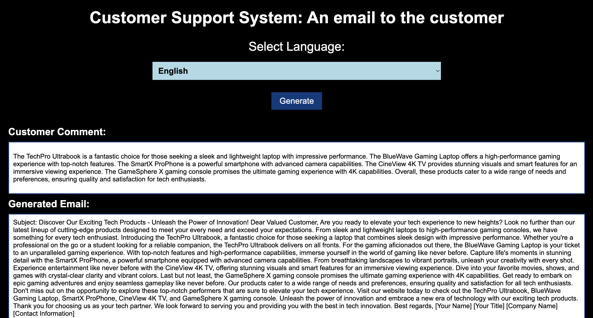

# Customer Support System: An email to the customer

The "Customer Support System: An Email to the Customer" project focuses on automating customer communication in an electronics store using ChatGPT. The objective is to generate customer comments, analyze sentiments, create subject lines for emails, and respond to the customers efficiently by leveraging AI.

# Process for the project implementation

## Step 1: Generate a Customer's Comment

    Input: Provide ChatGPT with detailed product descriptions.
    Output: ChatGPT generates a 100-word comment based on the products. This is used as input for further steps.
    Automation: The system automates the process of generating customer comments using predefined prompts for each product.

## Step 2: Generate Email Subject

    Input: The customer's comment from Step 1.
    Output: ChatGPT generates a relevant email subject using an inferring technique based on the comment.

## Step 3: Generate the Summary of the Customer's Comment

    Input: The customer's comment from Step 1.
    Output: ChatGPT summarizes the customer’s feedback using a summarizing technique.

## Step 4: Sentiment Analysis of the Customer's Comment

    Input: The customer's comment from Step 1.
    Output: ChatGPT performs sentiment analysis to determine if the feedback is positive or negative.

## Step 5: Generate an Email

    Input: The customer’s comment, summary, sentiment analysis, and email subject.
    Output: ChatGPT generates a customer-facing email in the selected language using an expanding technique. The email includes the comment summary and an appropriate response.

## Step 6: Send the Email

    The email generated in Step 5 is sent to the customer programmatically using Google APIs or Python code for testing purposes.

# Preparing the project

    Create the project folder
    Prepare the Python environment
    For managing environment variables use python-dotenv
    Use flask framework
    Create the OpenAI API key
    Load the OpenAI API key
    Use ChatGPT to fine tune

# Running the Application

    python app.py

# How It Works

    Generating comments for multiple products.
    Verifying email subject accuracy based on the comments.
    Checking the sentiment analysis results against known feedback types.
    Confirming email delivery through Google API integration.

# Screenshot of execution results

# To learn more

[Google Slide](./assets/CustomerSupportSystem_AnEmailToTheCustomer.pptx)
[GitHub](https://github.com/JTasnim/ChatGPTPromptEngineering_Email_To_Customer.git)
